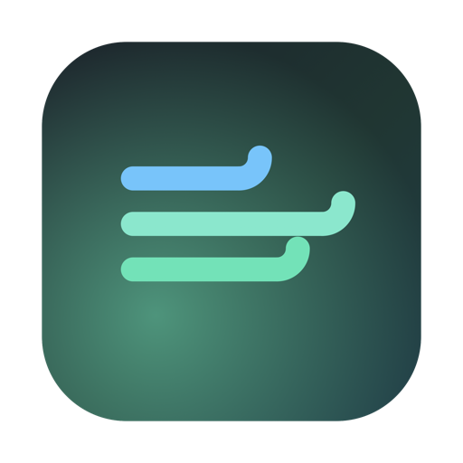
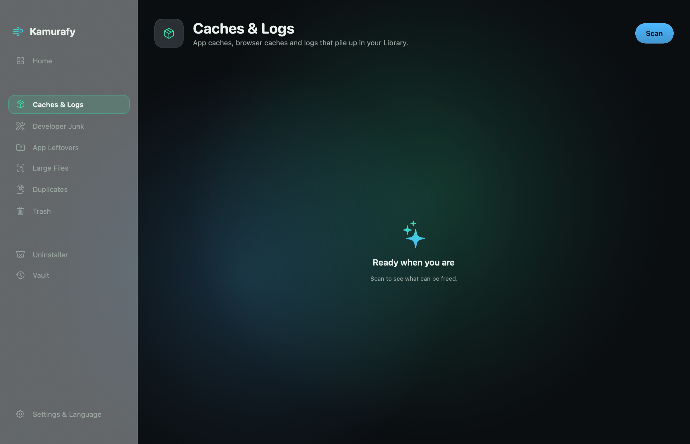

<div align="center">



# Kamurafy

**A fast, honest disk cleaner for macOS.**
One tap scans your whole Mac; the next frees it. Nothing leaves your machine.

*Um limpador de disco rápido e honesto para o macOS. Um toque escaneia o Mac inteiro; o próximo libera. Nada sai da sua máquina.*

   



</div>

---

## ✨ Features / Recursos

- **One-tap sweep** — every category scanned in parallel, cleaned in one tap.
- **Safety Vault** — cleaned files go to a restorable vault first; undo anytime, real deletion only after the retention window (off, 3, 7 or 30 days — you choose).
- **App Uninstaller** — remove an app *and* every trace it left (preferences, caches, containers).
- **Duplicate finder** — byte-identical files via a fast size → partial-hash → full-hash funnel.
- **Space breakdown** — after a scan, a segmented bar shows exactly where your space went.
- **Protected items** — mark any file or folder as off-limits; no clean will ever touch it.
- **Menu-bar companion** — live RAM/disk and a one-tap sweep without opening the window.
- **Auto sweep** — optional scheduled cleaning with a notification of what was freed.
- **Lifetime stats** — see how much you've freed over time.
- **28 languages** — auto-detects your system language, with an in-app picker to override.
- **Keyboard-first** — ⌘K scan, ⌘⌦ sweep, ⌘F filter.
- **Light on resources** — animations run on the compositor; the app sits near-idle.

### What it cleans / O que ele limpa
Caches & Logs · Developer Junk (Xcode, Homebrew, npm, pip, Gradle) · App Leftovers · Large Files · Duplicates · Trash.

> **Safety first.** Only regenerable junk is ever pre-selected for the one-tap sweep. Personal files and heuristic finds always arrive **unselected** — you decide. A single `SafeZone` gate validates every deletion; forbidden paths (`~/.ssh`, Keychains, `/System`, …) plus your own protected list are refused no matter what.

---

## 📦 Install / Instalar

1. Download `Kamurafy.dmg` from the [latest release](https://github.com/gabrielkamura/kamurafy/releases/latest).
2. Open it and drag **Kamurafy** to **Applications**.
3. First launch: right-click → **Open** → **Open** (the app is signed ad-hoc, not notarized).
4. For a complete scan, grant **Full Disk Access** in System Settings → Privacy & Security.

*Baixe o `Kamurafy.dmg`, arraste para Aplicativos e, na primeira vez, use botão direito → Abrir. Para varredura completa, conceda Acesso Total ao Disco.*

---

## 🌍 Languages

English · Português (BR/PT) · Español · Français · Deutsch · Italiano · Nederlands · Polski · Svenska · Čeština · Română · Ελληνικά · Українська · Русский · Türkçe · العربية · עברית · فارسی · हिन्दी · ไทย · Tiếng Việt · Bahasa Indonesia · Bahasa Melayu · 日本語 · 한국어 · 简体中文 · 繁體中文

---

## 🔨 Build from source / Compilar

No Xcode required — only the Command Line Tools:

```bash
git clone https://github.com/gabrielkamura/kamurafy.git
cd kamurafy
./build.sh          # → build/Kamurafy.app
```

`KamurafyKit` (the domain + safety core) builds as an embedded framework; the SwiftUI app links against it.

---

## 🧭 Architecture

```
KamurafyKit/        pure domain + safety, no UI (unit-tested)
  DiskScanner       parallel size measurement
  SafeZone          the deletion perimeter (allowlist + denylist + user guard)
  Eraser            the single deletion point (shred | vault)
  Vault             reversible-delete store
  Targets/          one CleanTarget per category
Kamurafy/           SwiftUI app (Model + UI, 28 localizations)
```

---

## 📄 License

**Copyright © 2026 Gabriel Kamura. All Rights Reserved.**

This source is published for viewing and evaluation only. Copying, modifying,
redistributing, or reusing any part of it — in whole or in part — without prior
written permission is prohibited. See [LICENSE](LICENSE).
